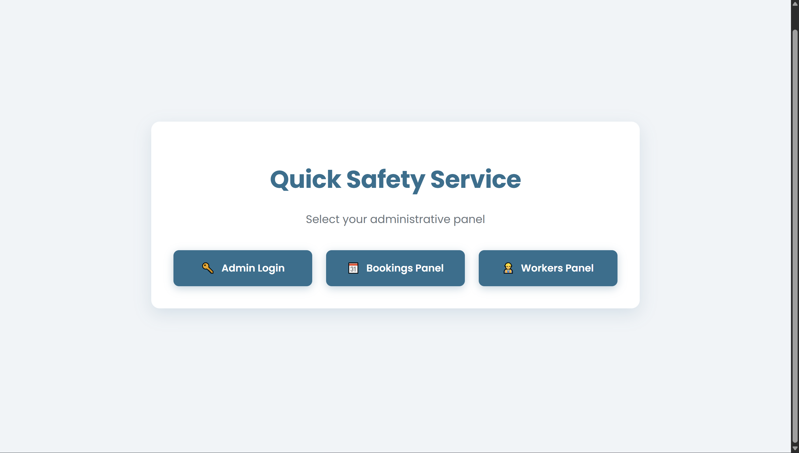
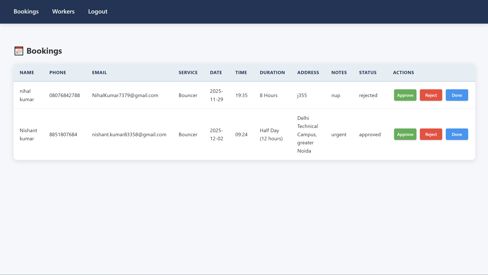

# Quick Safety Service (Backend)

This repository contains the Flask backend for the Quick Safety Service application.

**Screenshots**

- Home page screenshot:

  

  **Description:** Screenshot showing the public-facing home page (booking form and service information). Use this image to verify the UI and content layout for the customer-facing view.

- Admin / internal screenshot:

  

  **Description:** Screenshot illustrating an internal/admin view (worker/booking management). Use this image to check admin action buttons and layout.

**Overview**

- Backend framework: `Flask` (Python)
- DB / storage: `Supabase` (configured via environment variables in `.env`)
- Purpose: accept customer bookings, handle worker applications, and provide an admin interface to manage bookings and workers.

**Key Files**

- `app.py` — Main Flask application and routes.
- `config.py` — Loads configuration from environment variables.
- `supabase_client.py` — Supabase client helper used for DB and storage operations.
- `requirements.txt` — Python dependencies.
- `templates/` — All HTML templates (including `home.html`, `admin_bookings.html`, `admin_workers.html`).
- `static/` — Static assets (`style.css`, images, etc.)

**Setup (Windows PowerShell)**

1. Create and activate a virtual environment:

```powershell
python -m venv venv
.\venv\Scripts\Activate.ps1
```

2. Install dependencies:

```powershell
pip install -r requirements.txt
```

3. Create a `.env` file (in the project root) with the required variables. Example:

```text
SECRET_KEY=super-secret-session-key
SUPABASE_URL=https://your-project.supabase.co
SUPABASE_SERVICE_ROLE_KEY=your-service-role-key
ADMIN_USER=admin_username
ADMIN_PASS=admin_password
```

Note: Keep your `SUPABASE_SERVICE_ROLE_KEY` secret. Do not commit `.env` to source control.

**Run the app**

Run the Flask app directly (the repository already contains a runnable `app.py`):

```powershell
python app.py
```

By default the server listens on `http://0.0.0.0:5000` (visible on your LAN) and runs with `debug=True` in development mode.

**Admin**

- Admin login is available at `/admin/login`.
- Set `ADMIN_USER` and `ADMIN_PASS` in the `.env` file before logging in.

**Notes & Troubleshooting**

- If you get import errors, confirm the virtual environment is activated and dependencies are installed.
- If port 5000 is already in use, change the port in `app.py` or stop the conflicting service.
- For file uploads (worker Aadhaar/PAN/photo), the app uploads to a Supabase storage bucket named `worker-documents` — configure your Supabase project accordingly.

**Want changes?**

If you want different screenshots embedded, move the new images into the project root (or into `static/`) and update the image paths in this `README.md`.

---

Created to document and quickly run the backend. If you want a README tailored with additional developer notes (CI, local DB, test commands), tell me which items to add and I'll update it.